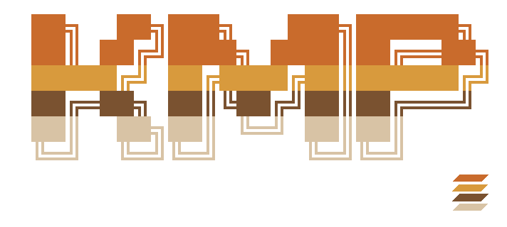
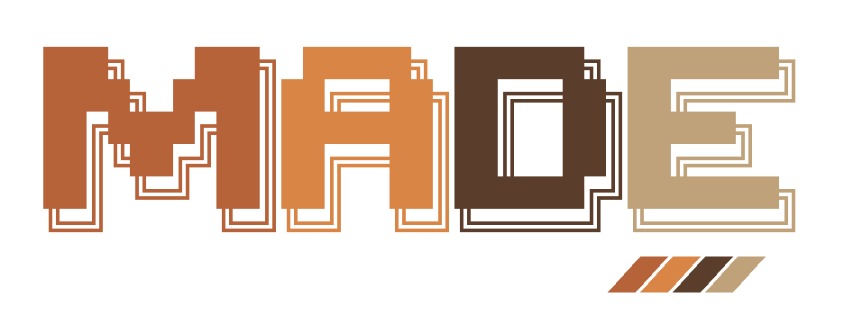

## Underpass AI

**Memory, coordination, and execution infrastructure for reliable AI agents.**

Website: [underpassai.com](https://underpassai.com)

Underpass AI builds the infrastructure around models: a memory plane that
agents can navigate and audit, a coordination plane for durable procedures
involving agents and people, and an execution plane that governs how agents
act on real systems.

We do not build foundation models. We build the operational substrate that
makes them safer, more useful, and easier to inspect in production.

| Memory | Coordination | Execution |
| :---: | :---: | :---: |
| [](https://github.com/underpass-ai/kmp) | [](https://github.com/underpass-ai/made) | [](https://github.com/underpass-ai/AXLR) |

### What We Build

**Memory plane — [KMP by Underpass](https://github.com/underpass-ai/kmp)**
gives Codex, Claude Code and Hermes Agent local-first memory. It stores decisions
and evidence in SQLite, with explicit clocks and relations that preserve what
changed, why it changed and what proves it. Agents recover scoped context, ask
for stored evidence, navigate history and audit the original sources. `UNKNOWN`
is an explicit outcome when the selected memory cannot answer.

**ChronoLoom** gives the person and the agent a shared view of that memory:
timelines, about layers, filters and proof paths. The person can take control
or undo a view move. A progressive guide teaches the agent how to use the live
MCP tools.

- **Local / embedded — the default.** The kernel runs inside the MCP process,
  with no database server, KMP account or hosted service required. Multiple local
  hosts can share SQLite memory. Native plugins support Codex and Claude Code;
  native setup supports Hermes. Reviewed portable bundles carry project memory
  between machines.
- **Shared service — optional and self-operated.** Typed gRPC APIs backed by
  Neo4j, Valkey and NATS JetStream, with Helm/Kubernetes deployment, TLS/mTLS and
  observability. Operators own the infrastructure, identity and authorization.
  Backend-specific capabilities are documented rather than assumed identical.

Default embedded retrieval needs no external model. Optional TypeSafe Jev
features send selected text to an external service for judgments; an optional
semantic encoder runs locally. Evidence returned to a cloud agent also follows
that host's data policy. Your agent writes the final answer from the evidence.

[Install KMP](https://github.com/underpass-ai/kmp#install-and-initialize-your-memory)
· [Embedded memory](https://github.com/underpass-ai/kmp/blob/main/docs/embedded/README.md)
· [Explore ChronoLoom](https://github.com/underpass-ai/kmp/tree/main/crates/kmp-viewer)

**Coordination plane — [MADE](https://github.com/underpass-ai/made)**
(Multi-Agent Deliberation Engine) coordinates shared procedures: who can act,
which work is ready, what needs review and when a person must decide. The host
supplies agents, tools and people. MADE validates their progress and records
accepted results in an auditable ceremony event stream.

- **Local / embedded — the default.** Plugins for Codex and Claude Code run
  through MCP and SQLite. Setup configures the store, authorization and a
  persistent search cursor key. No MADE account, deployed service or Kubernetes
  is required. Rust applications can embed the same engine. Publish definitions
  before starting ceremonies that must resume after restart.
- **Durable work and human review.** YAML ceremonies declare roles, sequential
  or concurrent steps, human guards, retries and deadlines. Hosts claim work,
  perform it and return results tied to the accepted claim. Pause/resume and
  explicit recovery preserve the audit trail; a claimed step alone performs no
  external work.
- **Systems and supervision in 0.8.0.** Compose published ceremonies into one
  system, hand a paused ceremony to an auditable successor, and send questions
  to working agents with tracked acknowledgements. An integrator host follows
  results, blockers and human decisions through a durable attention loop.
  The host still supplies execution; automatic host activation is opt-in.
- **Shared service — optional and self-operated.** gRPC, PostgreSQL, NATS and
  Helm/Kubernetes support shared deployments. Configured provider-backed
  councils can propose, critique, revise, validate and score contributions,
  with output contracts, an optional LLM judge, metrics and traces.

[Install MADE](https://github.com/underpass-ai/made/blob/main/docs/plugins/README.md)
· [Manual MCP setup](https://github.com/underpass-ai/made/blob/main/docs/embedded/README.md)
· [0.8 workflows and limits](https://github.com/underpass-ai/made/blob/main/docs/corte7/README.md)
· [Rust embedding](https://github.com/underpass-ai/made/blob/main/docs/embedded/rust.md)

**Execution plane — [AXLR](https://github.com/underpass-ai/AXLR)** runs the
agent's model turns and local tools in a trusted Linux workspace. Its interactive
console streams model output and saves sessions. AXLR also offers a Go library
and a one-request JSON worker for hosts. Tool approvals and an explicit execution
boundary govern local actions; standard MCP connections and Codex-compatible
plugin packages connect the memory and coordination engines.

[Explore AXLR](https://github.com/underpass-ai/AXLR)

Together these three planes form **infrastructure, not an application**. Any domain that
needs institutional memory plus governed action can be built on top.

### How It Works

A host can combine the three planes around a task or a domain event. MADE
coordinates the procedure, KMP recovers relevant memory, and AXLR runs the
agent's model turns and tools. The host configures the MCP connections and
records the evidence; installing one component does not automatically connect
the others.

```text
Task or domain event
  -> Host starts a published MADE ceremony
    -> Agents claim work; people decide at human guards
      -> Host uses KMP to recover scoped memory
        -> AXLR runs agent turns and approved tools
          -> MADE records accepted results; host preserves evidence in KMP
            -> The next task starts with that memory
```

The common pattern:

```text
domain event -> orchestration -> agent -> memory -> governed action -> evidence -> better memory
```

### Why It Matters

Reliable agents need memory they can navigate, not just context they can retrieve.

For real agentic work, it is not enough to ask which text chunk looks similar.
The system also needs to answer:

- what was known at a given moment;
- which attempt failed;
- what changed later;
- which agent introduced a wrong assumption;
- why one answer replaced another;
- which evidence supports the final result.

KMP by Underpass is built around that model: memory as a temporal, inspectable,
multidimensional graph, not just raw transcript replay or vector search over
chunks.

### Repositories

| Plane | Repository | Language | What it provides |
| --- | --- | --- | --- |
| **Memory** | [`kmp`](https://github.com/underpass-ai/kmp) | Rust | KMP by Underpass: local SQLite memory, decisions and evidence, temporal navigation, auditable relations, shared ChronoLoom view, native agent setup and optional self-operated gRPC service |
| **Coordination** | [`made`](https://github.com/underpass-ai/made) | Rust | MADE: local SQLite ceremonies, durable claims, human review, auditable successors, agent interventions, composed systems and integrator attention; optional shared service and provider-backed councils |
| **Execution** | [`AXLR`](https://github.com/underpass-ai/AXLR) | Go | Trusted-local agent loop, interactive console, saved sessions, approved tools, MCP and plugins, Go library and JSON worker |

[Underpass Runtime](https://github.com/underpass-ai/underpass-runtime) remains
available as the historical predecessor to AXLR.

The `rehydration-*` names are historical repository and artifact names. The
public memory product name is **KMP by Underpass**.

### Architecture: What We Own

| Component | Ownership | Examples |
| --- | --- | --- |
| **KMP by Underpass** | Underpass | Memory protocol, temporal traversal, graph inspection, evidence model, embedded distribution |
| **MADE** | Underpass | Durable ceremonies, human guards, system composition, delivery and attention protocols, council deliberation |
| **AXLR** | Underpass | Agent loop, local tool execution, approvals, MCP and plugin integration |
| **Integration adapter** | Product/team using Underpass | Alert relay, CI/CD hooks, ERP connectors, domain event emitters |
| **Application services** | Product/team using Underpass | payments-api, order-svc, internal platforms |
| **Observability and CI/CD** | Product/team using Underpass | Prometheus, Grafana, PagerDuty, GitHub Actions, ArgoCD |

### Production-Oriented Foundations

- **API first**: KMP behavior is defined by typed gRPC and domain contracts;
  MCP is an agent-facing adapter over the same memory semantics.
- **Explicit scope**: memory reads are scoped by current `about`, selected
  abouts, or intentionally global reads.
- **Temporal traversal**: `kmp_time` moves through explicit clocks with `goto`,
  `near`, `rewind` and `forward`; `kmp_trace` and `kmp_inspect` audit paths and sources.
- **Evidence and provenance**: recovered memory carries refs, proof, relation
  metadata, and traceability.
- **Fail-fast behavior**: invalid scopes and unsafe fallbacks are rejected
  instead of silently widening a query.
- **Observability**: structured logs, metrics, traces, and relation-quality
  signals make memory behavior auditable.
- **Infrastructure boundaries**: TLS/mTLS, Kubernetes deployment, Helm tests,
  and adapter-based persistence roles.

### Currently Building

**Durable coordination for agents and people** — MADE 0.8.0 connects published
ceremonies, human review and supervised systems. Its successor and intervention
protocols preserve where work happened and whether a question was acknowledged.
The integrator loop records intent before effect so a host can recover its
coordination state after a crash. See the
[MADE release](https://github.com/underpass-ai/made/releases/tag/v0.8.0) and
[declared limits](https://github.com/underpass-ai/made/blob/main/docs/corte7/README.md#still-declared-as-limits)
for the shipped scope.

**Replayable operational memory for AI agents** — a memory layer that lets
people and LLMs inspect what happened, what each agent knew, where the process
forked, which evidence mattered, and why the final resolution worked.

KMP's current public capabilities include:

- local SQLite memory shared by Codex, Claude Code and Hermes Agent;
- native installation workflows and a progressive guide for agents;
- anchored Ask with explicit answered, partial and unknown outcomes;
- a local lexical index for eligible reads, with ordinary retrieval as fallback;
- optional model-assisted retrieval and source-bound search expansions;
- ChronoLoom exploration shared between the person and the agent.

See the [KMP changelog](https://github.com/underpass-ai/kmp/blob/main/CHANGELOG.md)
for released changes and work still marked Unreleased. Retrieval experiments
carry their own measurements and limits; they are not general accuracy claims.

### Articles

- [No queremos agentes que contesten. Queremos decisiones que se puedan auditar](https://dev.to/tirsogarcia/no-queremos-agentes-que-contesten-queremos-decisiones-que-se-puedan-auditar-11gm)
- [Operator: cuando responder no basta](https://dev.to/tirsogarcia/operator-cuando-responder-no-basta-2kna)
- [Building Kernel Memory Protocol: Navigable Memory for AI Agents](https://dev.to/tirsogarcia/building-kernel-memory-protocol-navigable-memory-for-ai-agents-315j)
- [Construyendo Kernel Memory Protocol: memoria navegable para agentes de IA](https://dev.to/tirsogarcia/construyendo-kernel-memory-protocol-memoria-navegable-para-agentes-de-ia-24lc)
- [What an event-driven agent pipeline looks like when you trace it end-to-end](https://dev.to/tirsogarcia/what-an-event-driven-agent-pipeline-looks-like-when-you-trace-it-end-to-end-1cck)
- [Why event-driven agents reduce scope, cost, and decision dispersion](https://dev.to/tirsogarcia/why-event-driven-agents-reduce-scope-cost-and-decision-dispersion-2062)

### Status

KMP is pre-1.0 and actively evolving. Its default embedded path stores memory
locally in SQLite and exposes it through MCP, with ChronoLoom for visual
inspection. The optional remote API is versioned `v1beta1` and requires an
operator. Installation, backend limits and release status are maintained in the
[KMP repository](https://github.com/underpass-ai/kmp).

MADE 0.8.0 is published and pre-1.0. Its default path is a local plugin with
SQLite; a shared service and provider-backed councils are optional. Check the
[installation guide](https://github.com/underpass-ai/made/blob/main/docs/plugins/README.md)
for the release-pinned catalogue: the rolling marketplace can lag the latest
release. Existing stores and clients should follow the
[migration guide](https://github.com/underpass-ai/made/blob/main/docs/migrations/README.md).

The project is active and evolving quickly. Public repositories are released
under Apache-2.0 unless stated otherwise.

### Ownership

Underpass AI is a project created by
[Tirso Garcia Ibañez](https://github.com/tgarciai).

### Contact

[LinkedIn](https://www.linkedin.com/in/tirsogarcia/) ·
[GitHub](https://github.com/tgarciai)

- tgarciai@underpassai.com
- contact@underpassai.com
